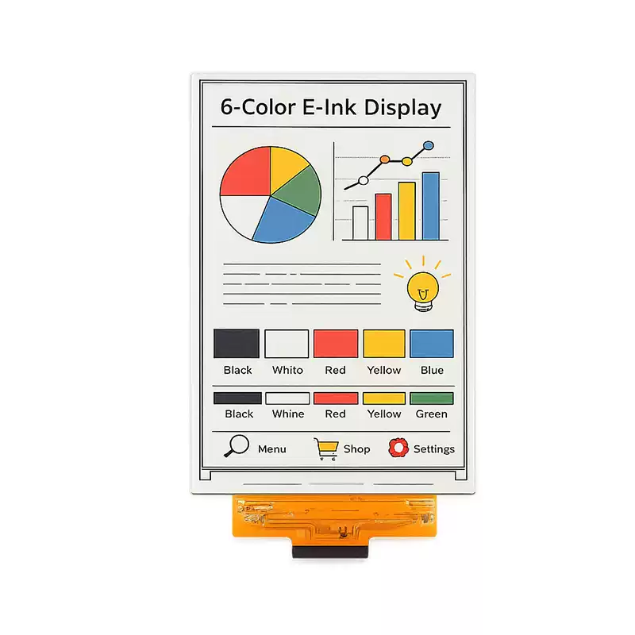

<h1 align="center">OSPTEK 7.09″ EPD 1200×1600 (TBD · SPI)</h1>

<b>E-paper module · SPI · TBD · Multi-Version Index</b>

English | <a href="./README.md">简体中文</a>

  
  
  
  

## Contents

- [About](#about)
- [Versions](#versions)
- [EPD0709A02](#epd0709a02)
- [How to Switch Branches](#how-to-switch-branches)
- [Where to Buy](#where-to-buy)
- [Support](#support)

---

## About

This repository holds materials for the **7.09″ 1200×1600 EPD (SPI · TBD)** module family.

**`main` is the navigation page** (repository default). Use the table below for a quick scan; click **Details** to jump to the section on this page. For a given version’s full content, switch to that **version branch** (see below).

Repo id: `7.09-epd-1200x1600-spi-tbd`

---

## Versions

| Version | Image | Notes |
| ------- | ----- | ----- |
| EPD0709A02 |  | [Details](#epd0709a02) |

---

## EPD0709A02

**Notes:** Six-color (black / white / red / yellow / blue / green).
---

## How to Switch Branches

Full product materials are on each **version branch**; `main` is navigation only.

- **Web:** open the branch dropdown at the top left of the repository page and select the branch that matches your part number.
- **CLI:** after cloning, run `git checkout <version-branch>`; if the repo is already local, `git fetch` first, then switch.

---

## Where to Buy

  
  &nbsp;&nbsp;
  

**International (AliExpress)**

- Store: [OSPTEK Official Store](https://www.aliexpress.com/store/1105701619)

**China (Taobao)**

- Store: [鱼鹰光电工厂店](https://shop110742373.taobao.com/)

---

## Support

- Technical Support / Sales: <luyu@osptek.com>
- QQ Technical Group: **985881096**
- Website: <https://osptek.com/>
- Feel free to open an Issue in this repository if you have any questions

---

© 2026 OSPTEK · Licensed under CC BY 4.0

